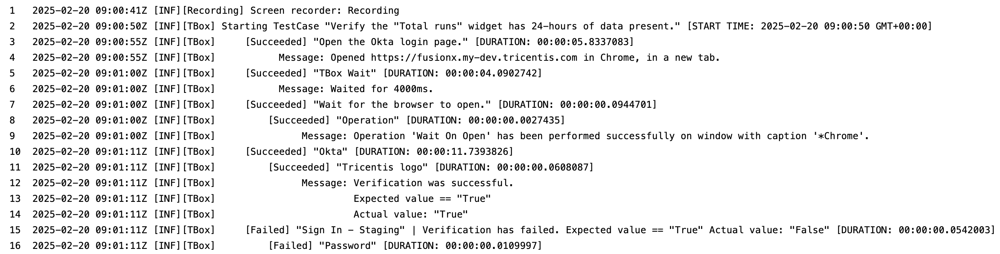
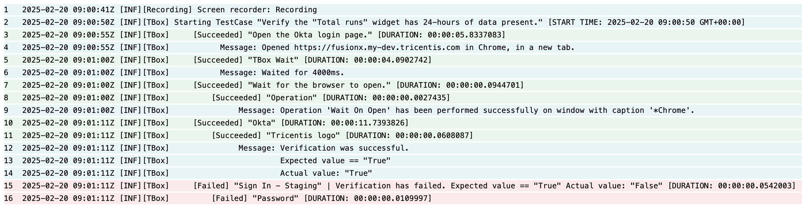
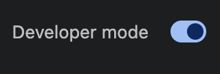
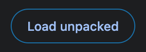
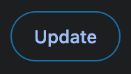
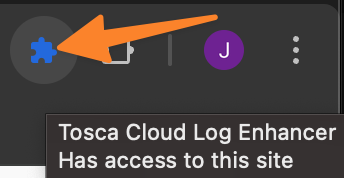
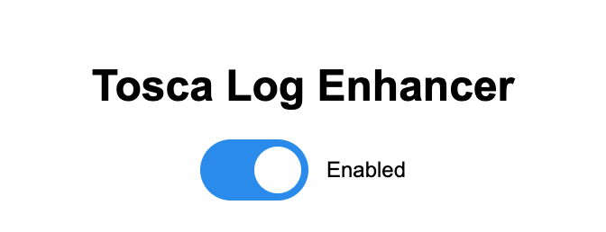

# Tosca Cloud Log Enhancer Chrome Extension

## Overview

Tosca Cloud Log Enhancer is a Chrome extension designed to improve the readability of Tosca Cloud logs by adding color-coded formatting.

## Features

- Color-coded log lines (Succeeded, Failed, Info).
- Toggle on/off functionality.
- Improved log readability.

## Examples

### BEFORE



### AFTER



## Compatibility

- Chrome Browser
- Tosca Cloud

## Installation Instructions

### Manual Installation (Developer Mode)

1. **Clone or Download the Project**

   ```bash
   git clone https://github.com/JStennett-Tricentis/ToscaCloudLogEnhancer.git
   ```

2. **Open Chrome Extension Management**
   - Open the Chrome Browser.
   - Navigate to `chrome://extensions/`.
   - Enable "Developer mode" (toggle switch in top right).

    

3. **Load Unpacked Extension**
   - Click "Load unpacked".

    

   - Select the project directory containing `manifest.json`.

## Development Setup

### Project Structure

```bash
ToscaCloudLogEnhancer/
│
├── manifest.json        # Extension configuration
├── popup.html           # Extension popup interface
├── popup.js             # Popup interaction logic
├── popup.css            # Popup styling
├── content.js           # Log enhancement script
├── icons/               # Extension icons
│   ├── icon16.png
│   ├── icon48.png
│   └── icon128.png
├── src/images/
│   ├── developerMode.png
│   ├── enhancedLogs.png
│   ├── extensionIcon.png
│   ├── loadUnpacked.png
│   ├── originalLogs.png
│   ├── toscaLogEnhancer.png
│   ├── update.png
└── README.md            # Project documentation
```

### Local Development

1. Make changes to source files.
2. Reload the extension in `chrome://extensions/`:
    - Click the "Update" button on the extension card.

    

## Usage

1. Navigate to Tosca Cloud test run log results page.
    - Ex: `https://[TENANT].tricentis.com/_portal/space/[WORKSPACE]/runs/[RUN ID]/results/[TEST CASE ID]?tab=logs`

2. Click the extension icon.

    

3. Use the toggle switch to enable/disable log enhancement.

    

## Troubleshooting

- Check browser console for any error messages.
- Verify extension is enabled in Chrome extensions.

## Known Limitations

- Requires manual installation until Chrome Store submission.
